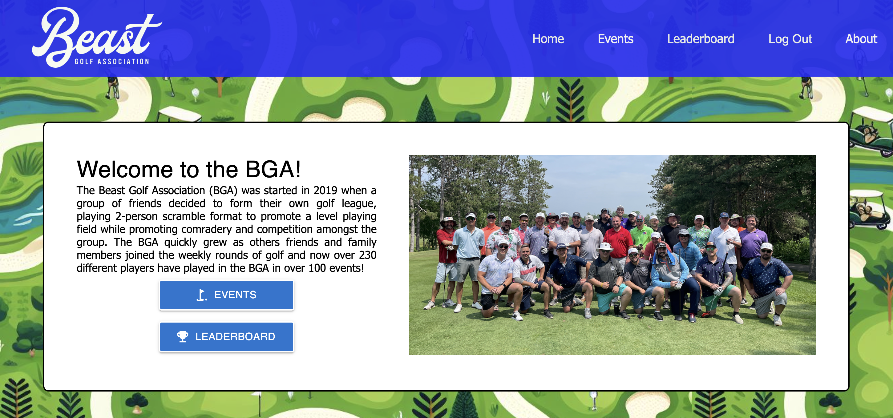

# Beast Golf Association (BGA) App


This is a golf app for 2-person scramble format that allows an admin the ability to add events, track scores and events played, and display the results in a leaderboard. This app uses the following tech stack:

- Frontend:
  - React
  - Material-UI
  - Emotion
  - Chart.js
- Backend:
  - Node.js
  - Express
  - PostgreSQL
  - Passport.js

## Prerequisites

Before you get started, make sure you have the following software installed on your computer:

- [Node.js](https://nodejs.org/en)
- [PostgreSQL](https://www.postgresql.org)
- [Nodemon](https://nodemon.io)

## Create Database and Table

Create a new database called `bga-app` and copy the `database.sql` file and paste it in the SQL query. Execute all statements to create the tables needed. Once, the app is running and a new user is registered, you will need to update the `user.access_level` in the database to `1` to have admin rights.

If you would like to name your database something else, you will need to change `bga-app` to the name of your new database name in `server/modules/pool.js`.

## Development Setup Instructions

- Run `npm install`.
- Create a `.env` file at the root of the project and paste this line into the file:

```plaintext
SERVER_SESSION_SECRET=superDuperSecret
```

While you're in your new `.env` file, take the time to replace `superDuperSecret` with some long random string like `25POUbVtx6RKVNWszd9ERB9Bb6` to keep your application secure. Here's a site that can help you: [Password Generator Plus](https://passwordsgenerator.net). If you don't do this step, create a secret with less than eight characters, or leave it as `superDuperSecret`, you will get a warning.

- Start postgres if not running already by using opening up the [Postgres.app](https://postgresapp.com), or if using [Homebrew](https://brew.sh) you can use the command `brew services start postgresql`.
- Run `npm run server` to start the server.
- Run `npm run client` to start the client.
- Navigate to `localhost:5173`.
